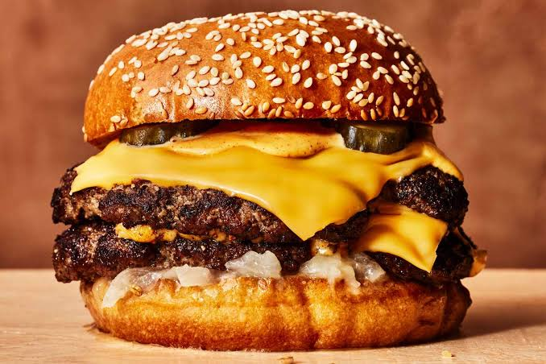

# sd-les5
dit is wat we moeten doen for github

## recept voor een burger*
*de foto zal er niet hetzelfde uitzien als wat u bereid
   
Hamburger Pattie   
▢800g – 1kg / 1.6 – 2 lb ground beef (mince), 20%+ fat (Note 1)   
▢Salt and pepper   
▢3 onions, peeled and sliced into rings   
▢2 tbsp oil   
▢4 – 8 slices cheese of choice, I use Swiss (optional)   
Hamburger   
▢4 soft hamburger buns, lightly toasted   
▢Lettuce, tomato slices   
▢Ketchup, mustard, relish, sliced pickles – or try my Special Burger Sauce!   
On the side   
▢French fries   
▢Baked potato wedges   

Cook Mode   
Prevent screen from sleeping   
Instructions   
Separate beef into 4 equal portions. Use hands to lightly form into patties the size of your buns (mine are about 10 cm / 4″) – don’t press hard, light fingers = soft juicy patties (see video for how I do this).   
Season generously with salt and pepper on both sides. Make a dent on one side (stop burger from become dome shape and shrinking when cooking).   
Heat 1 tbsp oil in a heavy based skillet or BBQ over high heat. Add onion and cook until wilted and caramelised. Season with salt and pepper, then remove.   
Heat 1 tbsp oil until smoking. Add patties and cook for 2 minutes until deep golden with a great crust. Do not press! Flip carefully, cook for 1 minute then top with cheese (if using). Cover with lid and cook for further 1 minute until cheese is melted.
Meanwhile, toast the cut side of the buns lightly.   
To serve: Spread base of buns with sauce / condiment of choice. Top with lettuce then tomato, then hamburger patty. Pile over onions, sliced pickles, then more sauce/condiments. Top with lid of bun. Serve immediately.   